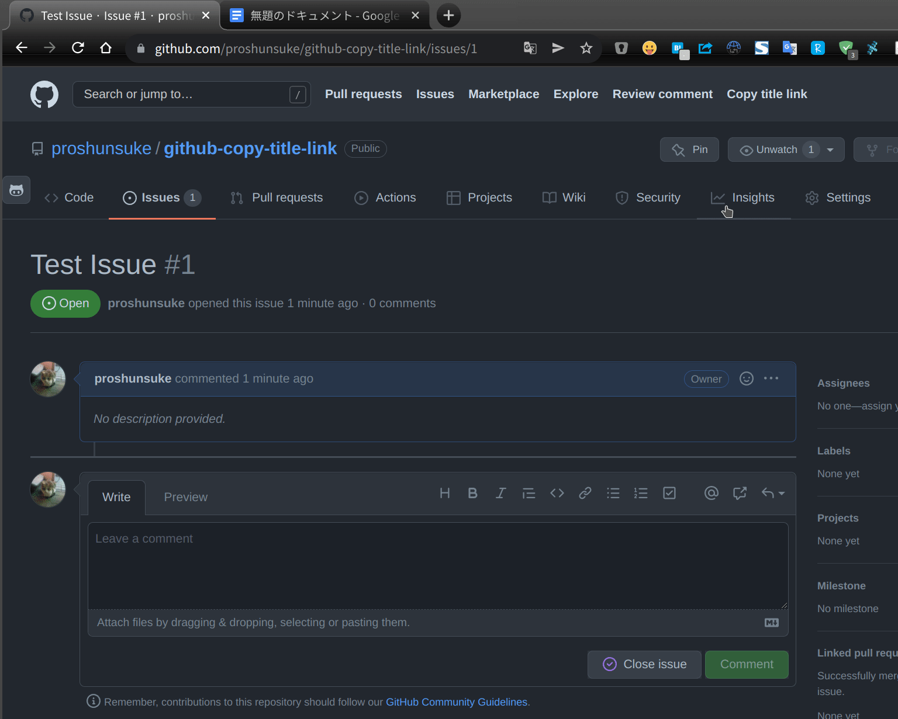

  <h1>GitHub Copy Title Link</h1>

## Features

In the header of the GitHub page, there will be a new item called "Copy title link".  
By clicking on that item, you can copy the title and URL from the pull request and issue on GitHub.  
And, you can paste them directly into Google Docs, for example.

## Installation

To use this script, you need a userscript manager.

- Install [Tampermonkey](https://www.tampermonkey.net/) or [Violentmonkey](https://violentmonkey.github.io/get-it/)
- Then, click on [this link](https://github.com/proshunsuke/github-copy-title-link/raw/main/github-copy-title-link.user.js) and a new tab should open, prompting you with an installation screen.
- Hit install.
